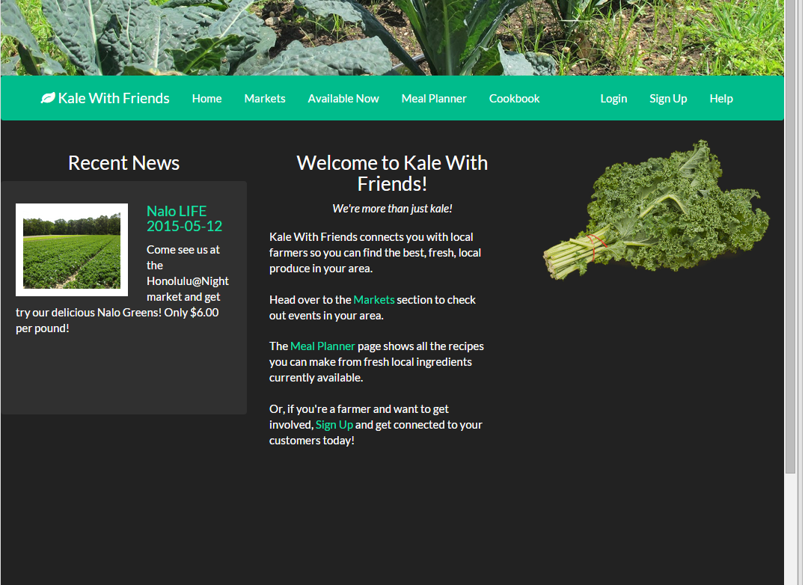
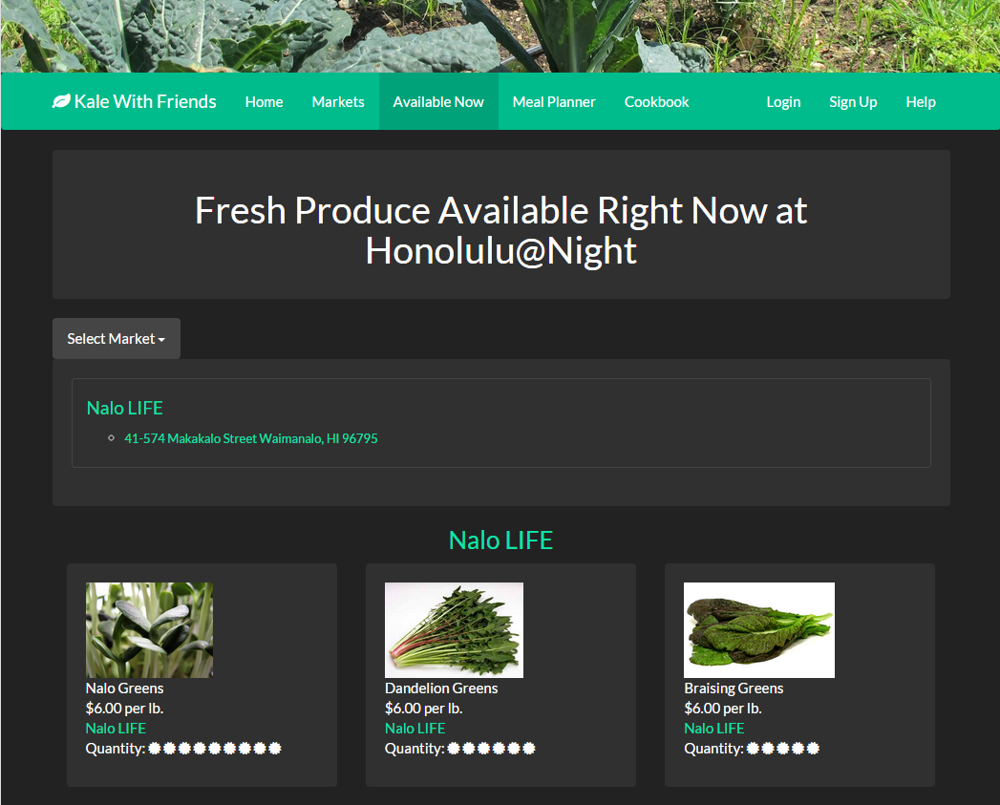
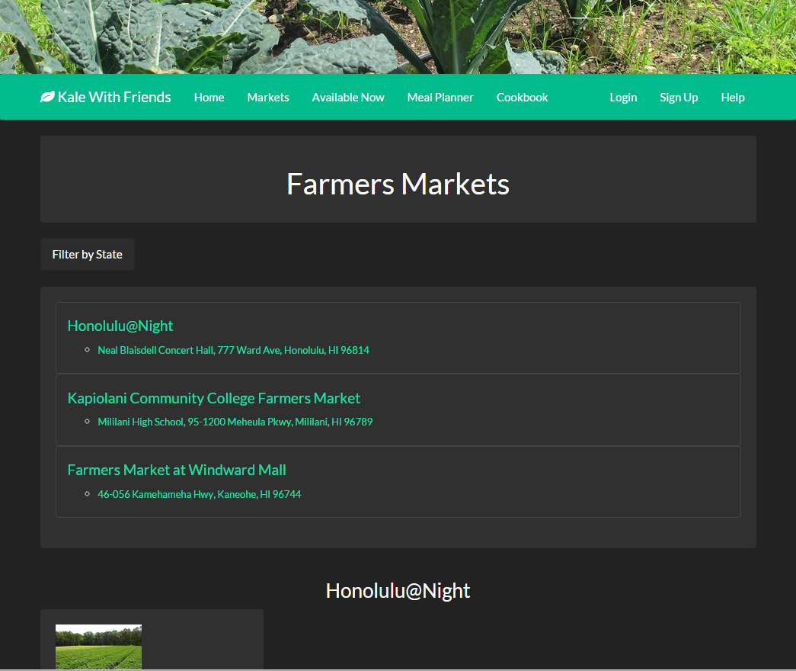

# Kale-With-Friends

## Quick Links

<a href="http://www.kalewithfriends.com">Check out KaleWithFriends.com</a> 
<a href="http://kalewithfriends.github.io/KaleWithFriends">View the Homepage</a> 
<a href="https://github.com/KaleWithFriends/KaleWithFriends/wiki/User-Guide">See the User Guide</a> 
<a href="https://github.com/KaleWithFriends/KaleWithFriends/wiki/Developer-Guide">See the Developer Guide</a> 
<a href="https://github.com/KaleWithFriends/KaleWithFriends/wiki/Contact-Us">Contacts</a> 

## Overview

Eating local produce is healthy and helps boost the local economy, but knowing what is available and getting it when it's at its freshest can be a challenge. Kale With Friends connects consumers and producers so everyone is aware of what is available nearby, where to buy it and how much it costs. If you grow produce, whether in a backyard garden or on a large scale commercial farm, and are interested in selling it, KWF will bring the local consumers to you.

Kale With Friends brings consumers and farmers together. Users can browse through a public list of markets, learn about the farmers that will be at the market, and see exactly what the farmers have to offer, all without leaving their home. For users that are new to eating locally, you can browse through our list of recipes and see exactly what you can make entirely out of fresh, local ingredients. If you are interested in participating and selling produce at a market, you can create a profile to advertise what they have available, where it can be bought, and let everyone know about specials with using the public feed. 

## Why Use Kale With Friends

Websites that allow users to enter ingredients they currently have and find recipes they can make have been done. Kale With Friends takes this idea a step further by enabling people to not only discover new, interesting recipes, but also get the absolute most out of local farms and growers. 

One of the most interesting features of our site is the Meal Planner. Farmers are responsible for keeping their online inventory up-to-date, then using this inventory, the Meal Planner searches the onlne list of recipes, finds the recipes that can be created using fresh, local ingredients and produce a list. Each item in the list links to the corresponding recipe page.

 
<i>Main view of the dashboard page. This shows the newest items in the public feed on the left, and quick links to get started.</i>

 
 
<i>The Available Now page allows users to select from the dropdown list of markets, then displays all of the produce currently avaialble.</i>

 
 
<i>The Farmer's Market page shows all of the markets that have been registered and all farmers that intend to participate in the market. There is a state filter to make it easier to find nearby markets.</i>

## Development Approach

There are two main parts to this project: the social network and the meal planner/cookbook. We plan to split the work into these two sections and have a team of two people focusing on each part. There will be considerable overlap in the backend data between the two parts, so we will have to do design the data structures as a single team. All code and assets will be stored in a single GitHub repository and the site itself will be built using the Play Framework and Twitter Bootstrap. Once complete it will be deployable on Heroku and available at <a href="http://www.kalewithfriends.com">www.kalewithfriends.com</a>.

## Deliverable 1
<strike>Users will be able to sign in, add items to their "fridge", search for recipes, and add them to their cookbook. Farmers will be able to sign in, and add and edit items to their stock. There will be a "local" page which contains a map of nearby places and a list of upcoming events (ex. farmers markets).</strike>

## Deliverable 2
<strike>The main focus of KaleWithFriends has shifted from the social network aspects to a bringing local ingredients to consumers more easily. For the second milestone we are working on allowing farmers to easily update their stock and add new produce to their inventory. In addition, individual user sessions will be implemented to allow unique profiles. Site will also be redesigned so it'll be easier to navigate.</strike>

## Deliverable 3
In addition to the functionality of the previous two deliverables, there is a market page which shows a list of all of the markets. The markets can be filtered by state, and under each  market is a list of all farmers attending. Clicking on a farmer from the market page takes the user to the farmer's page which lists all produce available now. The available now page also has a filter to allow users to browser the complete selection of produce available at each market, based on the farmers that have signed up.
