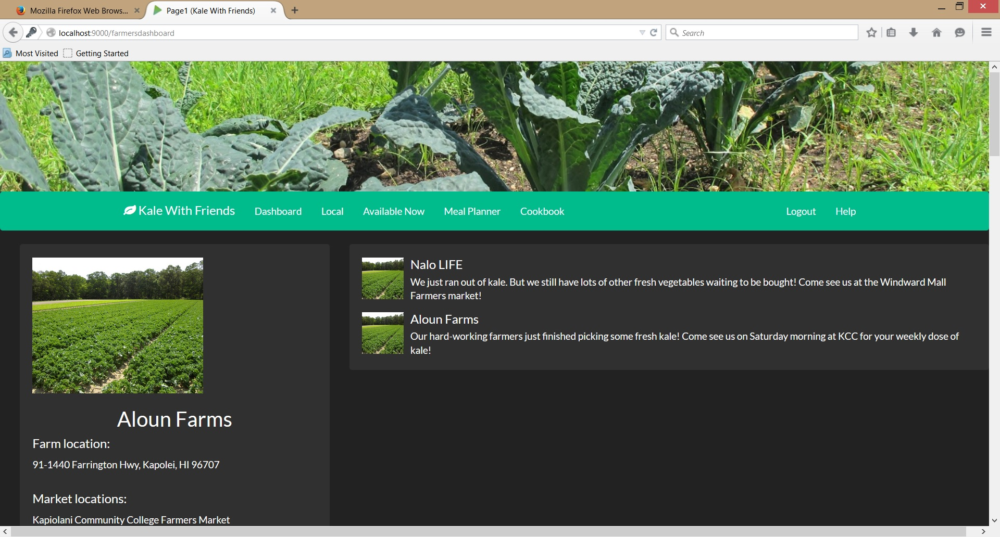
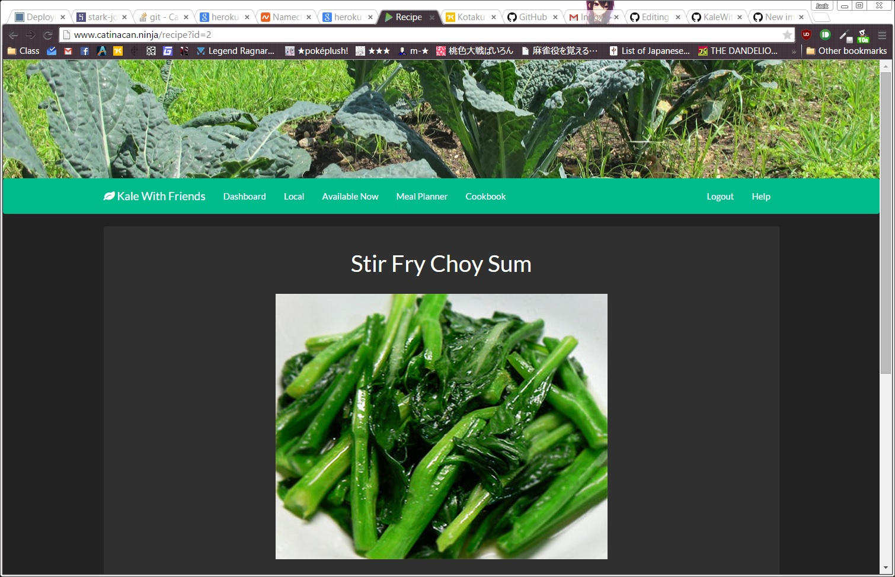

# Kale-With-Friends

## Quick Links

<a href="http://www.kalewithfriends.com">Check out KaleWithFriends.com</a> 
<a href="http://kalewithfriends.github.io/KaleWithFriends">View the Homepage</a> 
<a href="https://github.com/KaleWithFriends/KaleWithFriends/wiki/User-Guide">See the User Guide</a> 
<a href="https://github.com/KaleWithFriends/KaleWithFriends/wiki/Developer-Guide">See the Developer Guide</a> 
<a href="https://github.com/KaleWithFriends/KaleWithFriends/wiki/Contact-Us">Contacts</a> 

## Overview

Eating local produce is healthy and helps boost the local economy, but knowing what is available and getting it when it's at its freshest can be a challenge. Kale With Friends connects consumers and producers so everyone is aware of what is available nearby, where to buy it and how much it costs. If you grow produce, whether in a backyard garden or on a large scale commercial farm, and are interested in selling it, KWF will bring the local consumers to you.

Kale With Friends is a social style site intended to connect consumers with local farmers and producers. There are two types of profiles: consumers and farmers. Farmers create their profile to advertise what they have available and where it can be bought. This could be at their own farm or a nearby farmer's market. The consumer profile allows individuals to search nearby events and farms to see what is fresh and available, where to buy it, and even create meals based on what is currently fresh and available nearby. Users can search through a public cookbook, select their favorite recipes and see which ingredients are available locally.

## Why Use Kale With Friends

Websites that allow users to enter ingredients they currently have and find recipes they can make have been done. Kale With Friends takes this idea a step further by enabling people to not only discover new, interesting recipes, but also get the absolute most out of local farms and growers. 

One of the most interesting features of our site is the Meal Planner. Farmers are responsible for keeping their online inventory up-to-date, then using this inventory, the Meal Planner search the onlne list of recipes, find the recipes that can be created using all fresh, local ingredients and produce a list. Each item in the list links to the corresponding recipe page.

 
<i>Main view of the dashboard page.</i>

 
 
<i>Recipe page for "Kale Salad" linked from the Meal Planner.</i>

## Development Approach

There are two main parts to this project: the social network and the meal planner/cookbook. We plan to split the work into these two sections and have a team of two people focusing on each part. There will be considerable overlap in the backend data between the two parts, so we will have to do design the data structures as a single team. All code and assets will be stored in a single GitHub repository and the site itself will be built using the Play Framework and Twitter Bootstrap. Once complete it will be deployable on Heroku and available at <a href="http://www.kalewithfriends.com">www.kalewithfriends.com</a>.

## Deliverable 1
<strike>Users will be able to sign in, add items to their "fridge", search for recipes, and add them to their cookbook. Farmers will be able to sign in, and add and edit items to their stock. There will be a "local" page which contains a map of nearby places and a list of upcoming events (ex. farmers markets).</strike>

## Deliverable 2
The main focus of KaleWithFriends has shifted from the social network aspects to a bringing local ingredients to consumers more easily. For the second milestone we are working on allow farmers to easily update their stock and add new produce to their inventory. In addition, individual user sessions will be implemented to allow unique profiles. Site will also be redesigned so it'll be easier to navigate.

## Deliverable 3
In addition to the functionality of the previous two deliverables, the third expand the meal planner to include a budget, expiration dates of food and display recipes that meet some minimum threshold of local ingredients. At this point the farmer, recipe, and available now pages will all link to the local map which will display exactly where to buy the various foods.
