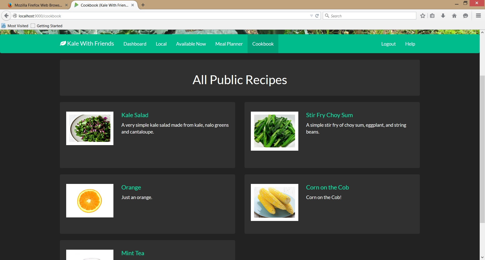
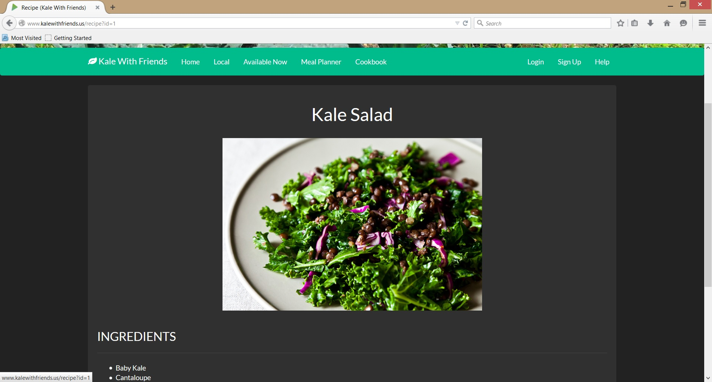
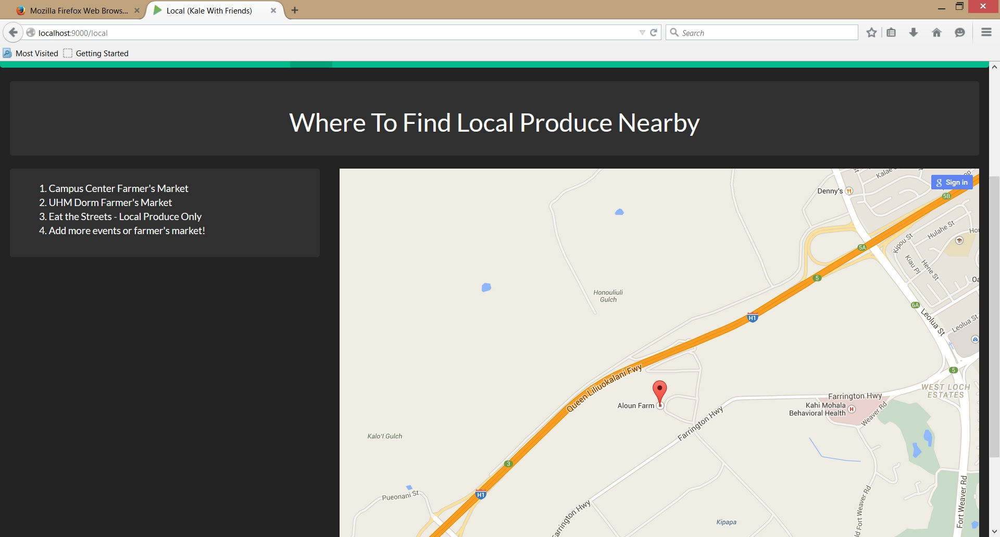

# Kale-With-Friends

## Overview

Eating local produce is healthy and helps boost the local economy, but knowing what is available and getting it when it's at its freshest can be a challenge. Kale With Friends (working title) connects consumers and producers so everyone is aware of what is available nearby, where to buy it and how much it costs. If you grow produce, whether in a backyard garden or large scale commercial farm, and are interested in selling it, KWF will bring the local consumers to you.

Kale With Friends is a social style site intended to connect consumers with local farmers and producers. There are two types of profiles: consumers and farmers. Farmers create their profile to advertise what they have available and where it can be bought. This could be at their own farm, or a nearby farmer's market. The consumer profile allows individuals to search nearby events and farms to see what is fresh and available, where to buy it, and even create meals based on what is currently in their fridge and what is available nearby. Users can search through a public cookbook, select their favorite recipes and see which ingredients are available locally.

## Approach

There are two main parts to this project: the social network and the meal planner/cookbook. We plan to split the work into these two sections and have a team of two people focusing on each part. There will be considerable overlap in the backend data between the two parts, so we will have to do design the data structures as a single team. All code and assets will be stored in a single GitHub repository and the site itself will be built using the Play Framework and Twitter Bootstrap. Once complete it will be deployable on Heroku. 

## Deliverable 1
Users will be able to sign in, add items to their "fridge", search for recipes, and add them to their cookbook. Farmers will be able to sign in, and add and edit items to their stock. There will be a "local" page which contains a map of nearby places and a list of upcoming events (ex. farmers markets).

## Deliverable 2
In addition to the previous deliverable functionality, users will be able to create a social network by adding friends, and communicating with them by sharing recipes. Users will also be able to rate and comment on recipes and farmers. There will be a functioning meal planner that allows users to plan out their meals for upcoming weeks by chosing recipes and placing them on the calendar.

## Deliverable 3
In addition to the previous deliverable functionality, the stock (in the user's fridge and in the farmer's market) will have expiration dates. There will be a functioning meal planner that can take in a user's food preferences, a budget, their current fridge items, and their location, and automatically generate meals for the upcoming week, with recommendations on where to buy the ingredients that they need.

## Mockup

